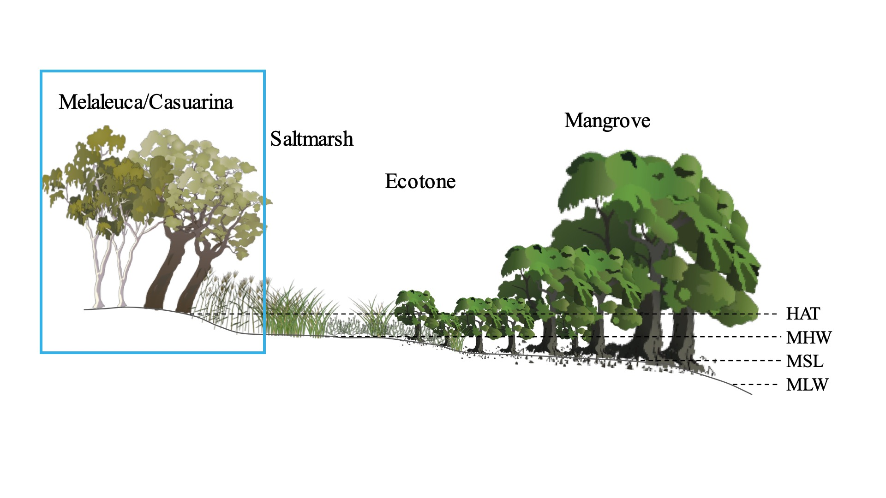

#  Supratidal Forests

### Mapping supratidal forest extent of Australia

#

| | |
|-|-|
|__Disclaimer__| This repository is *in development*, use at your own risk |
|__License__| The Apache 2.0 license applies to this open source code. |

### About
This repository includes scripts and notebooks for developing a national supratidal forest extent workflow for Australia specific for integration within [Digital Earth Australia](https://www.dea.ga.gov.au/). The project is being led by [Dr Chris Owers](https://www.newcastle.edu.au/profile/chris-owers), [Dr Jeff Kelleway](https://scholars.uow.edu.au/jeffrey-kelleway) and [Dr Rafael Carvalho](https://www.newcastle.edu.au/profile/rafael-carvalho)

### What is a supratidal forest?
(Jeff/Raf to add)

### Why are supratidal forest important?
(Jeff/Raf to add)

### Where do they occur?
(Jeff/Raf to add)

### How can we map them?
(Jeff/Chris/Raf to add)

### Publications
Below is a reference list of publications on supratidal forests for more information on this unique coastal ecosystem

> Kelleway et al., 2021 [Carbon Storage in the Coastal Swamp Oak Forest Wetlands of Australia](https://agupubs.onlinelibrary.wiley.com/doi/abs/10.1002/9781119639305.ch18)
