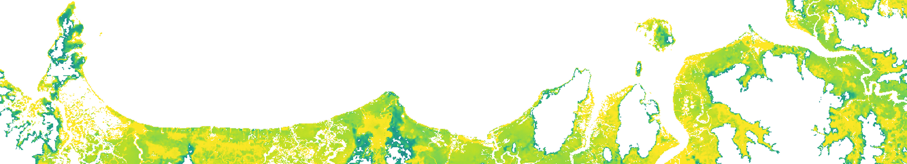
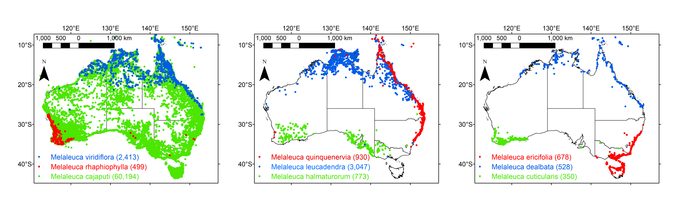
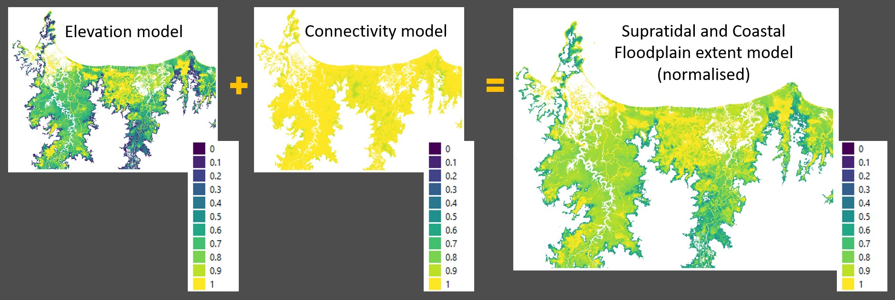
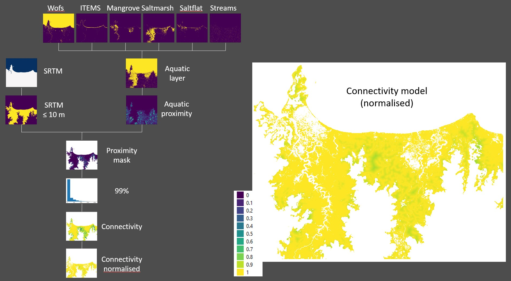

#  Supratidal and Coastal Lowland Forests

### National mapping of Australia's Supratidal and Coastal Lowland Forests

#

| | |
|-|-|
|__Disclaimer__| This repository is *in development*, use at your own risk |
|__License__| The Apache 2.0 license applies to this open source code. |

### About
This repository contains descriptions, scripts and notebooks for developing a national __*Supratidal and Coastal Lowland Forest*__ extent workflow for Australia, using [Digital Earth Australia](https://www.dea.ga.gov.au/). This workflow provides indices which reflect the likelihood of woody vegetation coverage (i.e. forest and woodland ecosystems) within specified thresholds of elevation and connectivity in the coastal zone. This extent workflow is therefore inclusive of intertidal and supratidal ecosystems, and also includes potentially non-tidal ecosystems which lie within these elevation and connectivity thresholds. The project is being developed by [Dr Chris Owers](https://www.newcastle.edu.au/profile/chris-owers), [Dr Rafael Carvalho](https://www.newcastle.edu.au/profile/rafael-carvalho) and [Dr Jeff Kelleway](https://scholars.uow.edu.au/jeffrey-kelleway).

---

### Table of contents
- [About](#about)
- [Project background](#project-background)
- [What are Supratidal and Coastal Lowland forests?](#what-are-supratidal-and-coastal-lowland-forests)
  - [Conceptual definition](#conceptual-definition)
  - [Mapping definition](#mapping-definition)
- [Typology](#typology)
- [Interaction with existing classifications and typology schemes](#interaction-with-existing-classification-and-typology-schemes)
- [Relationship with other ecosystems globally](#relationship-with-other-ecosystems-globally)
- [SCLF habitats - extent model](#sclf-habitats---extent-model)
  - [Elevation model](#elevation-model)
  - [Connectivity model](#connectivity-model)
- [Spatial and Temporal consistency](#spatial-and-temporal-consistency)
- [References](#references)

---

### Project background
‘Supratidal forests’ is a term which has emerged among the coastal wetland research and management community in Australia to define a broadly-distributed group of coastal ecosystems on the basis of their (1) __position within the coastal landscape__ and (2) __vegetation structure__. Research to-date suggests these forests may play important roles in the cycling and storage of carbon and nutrients in the coastal zone (Adame et al. 2019, Iram et al. 2021, Kelleway et al. 2021), among other ecosystem services. Supratidal and associated floodplain forests of the coastal zone have been subjected to significant historic losses and land-use pressures (Keith and Scott 2005, Boon et al. 2016). Their low-lying position within the coastal zone – where catchment, aquatic and anthropogenic processes interact - may make these forests particularly susceptible to changes in inundation and/or salinization (Saintilan et al. 2018, Conroy et al. 2022).

The lack of continental-wide information on supratidal forests is a significant missing link in knowledge of the distribution of coastal blue carbon ecosystems in Australia. Without the ability to classify these forests using remotely sensed imagery, it is currently not possible to identify where this ecosystem exists across Australia or to track changes over time, including increases in extent from restoration projects. This project will develop a national __*Supratidal and Coastal Lowland Forest (SCLF)*__ mapping workflow and associated spatial datasets for Australia. The outputs from this project will align with Australia’s Ocean Accounts, providing a missing piece in national mapping and reporting on Australia’s ocean-based natural assets.

This new mapping product is intended to complement existing national, state and local mapping initiatives, which are important for understanding the distribution and management of significant biodiversity values (including threatened species and ecological communities which may occur within or comprise __*SCLF*__). 

---

### What are Supratidal and Coastal Lowland Forests?

#### Conceptual definition

Supratidal forests have been defined and differentiated from other coastal ecosystems on the basis of their position within the coastal landscape (i.e. typically occurring at higher elevations than mangrove forests, and lower elevations than ‘terrestrial’ forests) and vegetation structure (i.e. trees and tall shrubs contrasting the vegetation structure of herbaceous marshes or unvegetated flats which may also occupy similar or adjacent elevation ranges) (Carvalho et al. 2024, Kelleway et al. _accepted_). There are both conceptual and technical challenges which prevent the clear separation of ‘supratidal forests’ from other low-lying ‘coastal lowland forests’ in the coastal zone, which have necessitated their pooling together in a __*SCLF*__ map. These factors are explored in further detail below, with examples encountered in Australian settings. While multiple geomorphic and vegetation classes are described, the Australian __*SCLF*__ map generated in this project provides an index which reflects the likelihood of ‘__*SCLF*__’ undifferentiated on the basis of either geomorphic or vegetation composition classes.

(1) Position within the coastal landscape

Forested wetlands exist across multiple landscape positions within the coastal zone, including intertidal, supratidal, non-tidal, riverine and floodplain and non-floodplain settings (Figure 1). In some instances, this may include distributions at or below mean sea level, depending on natural and/or anthropogenic barriers to inundation. Little to no quantification of salinity regimes is available for most supratidal forest or non-tidal coastal lowland forest settings in Australia, though spatial and temporal variability is expected across the settings described above. Groundwater is also likely to play a significant and potentially variable role in the distribution and composition of forests in the coastal zone, however there are significant challenges associated with its use in mapping products. For these reasons, the description of geomorphic classes below currently focuses on variables of elevation and inundation and does not explicitly consider salinity or groundwater dynamics.
In estuaries and embayments experiencing tidal exchange, non-mangrove forested wetlands may include distribution within the highest elevations of the intertidal zone (i.e. __‘A. upper intertidal forest’__ in Figure 1). More typically these forests occur within the supratidal zone - that is, at elevations above the mean high water spring tidal datum through to elevations at or above the highest astronomical tide (i.e. __‘B. supratidal forest’__). In these supratidal elevations, wetlands may be influenced by storm surges and tidal anomalies associated with weather conditions (e.g. anomalies in atmospheric pressure and/or winds) which result in higher than expected tides.

Seasonal-flooding of forests via rainfall and catchment runoff may occur either in areas subject to occasional surface tides (i.e. geomorphic classes A and B), or in low-lying floodplains and other palustrine wetlands without direct tidal influence (i.e. __‘C. coastal lowland forest’__). The indirect influence of tides – via the maintenance or raising of high water tables and impedance of drainage – may still act as a hydrological control in this geomorphic sub-type, and so it is included in the broad definition of __*SCLF*__ in this project.

&nbsp;

__Figure 1.__ Typical position of __*SCLF*__ within the coastal zone, in relation to the tidal frame, non-tidal inundation, and adjoining intertidal and terrestrial ecosystems. Three geomorphic classes of __*SCLF*__ (A. upper intertidal forest; B. supratidal forest; C. coastal lowland forest without direct tidal influence) are presented. MSL = Mean Sea Level; MHWS = Mean High Water Spring; HAT = Highest Astronomical Tide; AHD = Australian Height Datum. 

&nbsp;

Where there are barriers to tidal inundation (e.g. behind geomorphic features such as ridges and levees, or anthropogenic features such as floodgates and bund walls), forested wetlands may also occur on coastal lowlands at elevations near or below mean sea level and may be subject to sporadic or seasonal flooding (Figure 1). While this specific class of forested wetland is unlikely to be directly influenced by surface tidal inundation, it may be subject to other coastal processes (including indirect influences of tides on the water table).

A more complex scenario arises in coastal waterbodies which experience intermittent opening to tidal flows, such as intermittently closed and open lakes and lagoons (ICOLLs), or behind anthropogenic structure which manipulate tidal and non-tidal levels (e.g. behind tidal barrages). In these settings, inundation dynamics are controlled by interactions between estuary entrance or structure status (i.e. open or closed) and catchment inflows and evaporation (Figure 2). For example, areas above the highest astronomical tide (HAT) (as defined under open ICOLL conditions in Figure 2a), may experience greater depth and extent of inundation with brackish or fresh waters for periods of time following closure of the entrance (Figure 2b). In these instances, the distribution of supratidal forest may extend to elevations higher than in permanently open settings, with these elevations referred to here as a separate geomorphic class __D. ‘perched’ supratidal forests__. Such changes in water depth and inundation extent have implications for the distribution of supratidal forests across upper intertidal, supratidal and ‘perched’ supratidal elevations, as forest species may respond dynamically - via expansion or contraction - according to inundation and salinity tolerances.

__Figure 2.__ Typical position of __*SCLF*__ and associated ecosystems within intermittently closed and open lakes and lagoons (ICOLLs) during open-entrance conditions (a) and closed-entrance conditions (b). MSL = Mean Sea Level; HAT = Highest Astronomical Tide; AHD = Australian Height Datum.

&nbsp;

(2) Vegetation structure and composition

__*SCLF*__ occur within the geomorphic positions described above, across low-energy settings of many coastlines and estuaries around Australia. This includes distributions across tropical, sub-tropical and temperate climatic zones, though little to no distribution is expected along semi-arid and arid coastlines where unvegetated flats and/or small-statured succulents dominate the supratidal zone. 

__*SCLF *__ in Australia may comprise and support multiple species of trees, shrubs, and groundcover vegetation (including saltmarsh and/or other marsh species). In some settings, groundcovers may be limited or absent, though leaf litter and downed wood coverage is often high.

__*SCLF*__ in Australia are typically dominated by one or both of two genera: _Melaleuca_ and _Casuarina_. Significantly, these genera differ from most mangrove taxa in that they occur not only within the coastal fringe, but also dominate terrestrial forests and freshwater wetlands over broad areas of Australia. Consequently, it is important to consider landscape position, along with vegetation structure, in any effort to map the distribution of supratidal forests. 

The genus __*Melaleuca*__ (family: __*MYRTACEAE*__) incorporates multiple species distributed in the coastal zones of Australia (Figure 3), with some distributions also extending through parts of southeast Asia (Tran et al. 2015). The _Melaleucas_, often collectively termed paperbarks and/or tea trees, may have diverse growth habits and physiological tolerances to inundation and salinity. For example, trees of _M. viridiflora_, _M. cajaputi_ and _M. leucadendra_ of >15 m height may dominate coastal lowland forests and backswamps in northern Australia (Finlayson 2005, Sloane et al. 2019), whereas shorter stands (including shrubby thickets of just a few metres tall) of M. ericifolia and/or _M. halmaturorum_ (SE Australia) or _M. rhaphiophylla_ and/or _M. cuticularis_ (SW Australia) dominate along temperate coastlines (Carter et al. 2006, Turner et al. 2006).

__Figure 3.__ Distribution records of the dominant species of the genus _Melaleuca_ commonly found within the coastal zone (data source: The Australasian Virtual Herbarium / Atlas of Living Australia; number of records listed in parentheses).

&nbsp;

Coastal Swamp Oak Forests dominated by the genus __*Casuarina*__ (family: __*CASUARINACEAE*__) forms the landward border of intertidal saltmarshes and/or mangroves, particularly along the east coast of Australia (southern NSW to central QLD) (Boon et al. 2016). _Casuarina glauca_ occurs on low-lying alluvial floodplains distributed along the temperate coast of NSW and the sub-tropical coast of QLD. _Casuarina equisetifolia_ has a native distribution across coastal northeast Australia, whereas _Casuarina obesa_ has a native range predominantly across the southern part of Western Australia (Carter et al. 2006, Kelleway et al. 2022) (Figure 4). Forests and woodlands of the genus _Casuarina_ cover approximately 16,500 km2 of the Australian continent. However, much of this coverage occurs outside coastal catchments.

&nbsp;

__Figure 4.__  Distribution records of the dominant salt-tolerant species of the genus _Casuarina_ commonly found within the coastal zone: _C. glauca_, _C. obesa_, _C. equisetifolia_ (data source: The Australasian Virtual Herbarium / Atlas of Living Australia; number of records listed in parentheses). 

&nbsp;

A diversity of other taxa contribute to the tree and shrub flora of Supratidal forests in Australia, including other members of __*MYRTACEAE*__ - e.g. swamp mahogany (_Eucalyptus robusta_), forest red gum (_E. tereticornis_), swamp turpentine (_Lophostemon suaveolens_) as well as freshwater mangroves (_Barringtonia acutangula_), and a variety of palms (e.g. _Pandanus spiralus_, _Livistonia australis_), among other taxa. Examples of various geomorphic and vegetation classes encountered around Australian coast are presented in Figure 5.

&nbsp;

__Figure 5.__ Examples of geomorphic and vegetation classes of __*SCLF*__ and adjoining ecosystems:  
(a) Spring tide inundation of _Casuarina glauca_ Swamp Oak Forest supratidal forest (background) and coastal saltmarsh (foreground), Minnamurra River estuary, NSW  
(b) _Melaleuca_ spp. and _Baringtonia acutangula_ supratidal forest (right) adjacent to coastal saltmarsh (centre) and _Avicennia_ mangrove (left), Mary River estuary, NT  
(c) _Melaleuca leucadendra_ supratidal forest (background) adjacent to saltmarsh, saltflat and mangrove (foreground), Killaloe, QLD  
(d) Non-tidal _Melaleuca_ spp. floodplain forest (dry season), Mary River, NT.  
(e) _Melaleuca_ spp. supratidal forest (background) adjacent to coastal saltmarsh (foreground), Nornalup Inlet, WA  
(f) Mixed _Casuarina glauca_ and _Melaleuca ericifolia_ forests and herbaceous reed/rush understorey inundated during closed estuary entrance conditions, Willinga Lake (ICOLL), NSW  
(g) _Melaleuca ericifolia_ forest (left) and adjacent coastal saltmarsh (centre) during low water conditions of open estuary entrance conditions, Tilba Tilba Lake (ICOLL), NSW  

&nbsp; 

#### Mapping definition

A continental-scale mapping workflow for __*SCLF*__ has been developed which is inclusive of the multiple landscape position and vegetation features described in the conceptual definition above. This workflow includes three key parameters by which areas will be included in the mapping product: 
1.	Landscape position within the coastal zone and a suitable elevation envelope (i.e. upper and/or lower elevation thresholds);
2.	Landscape position within the coastal zone that is connected to tidal waters (or intertidal vegetation)
3.	Woody or forested vegetation, as defined by exceedance of a ‘woody cover’ threshold using nationally-available remote sensing products;
4.	Not mapped as mangrove (or other coastal vegetation such as saltmarsh and intertidal seagrass) under existing nationally-available mapping products.

The national __*SCLF*__ map generated in this project will utilise the above criteria to provide an index which reflects the likelihood of ocurrence of __*SCLF*__, which is undifferentiated on either the basis of vegetation composition or geomorphic classes.

---

### Typology

We have identified four broad geomorphic classes of coastal forested wetland which will be captured (though undifferentiated) within the new national mapping product. The conceptual basis for these classes is described in the sections above, displayed in Figures 1 and 2, with key parameters described in Table 1.
 
&nbsp; 

__Table 1.__ Summary of the geomorphic classes of coastal forested wetland expected to be captured within the national supratidal forest mapping product. HAT = Highest Astronomical Tide; ANAE = Australian National Aquatic Ecosystem.

| - | A. Upper intertidal forests | B. Supratidal forests | C. Coastal floodplain forests | D. Perched supratidal forests |
| - | - | - | - | - |
| Position relative to tidal frame | intertidal zone | supratidal zone | non-tidal | non-tidal |
| Lower elevation limit | nil | HAT | nil | nil |
| Upper elevation limit | HAT | maximum storm-surge/atmospheric anomaly level | maximum flood height | maximum flood height |
| Drivers of inundation | spring tides, extreme tides (atmospheric anomalies), groundwater | extreme tides (atmospheric anomalies), storm surge, seasonal or non-seasonal flooding, groundwater | seasonal or non-seasonal flooding, groundwater | waterway entrance conditions, seasonal or non-seasonal flooding, groundwater |
| Expected salinity regime | marine to freshwater; high spatial and/or temporal variability | low salinity to freshwater; high spatial and/or temporal variability | low salinity to freshwater | low salinity to freshwater |
| ANAE Level 3 Aquatic Classes | Marine or Estuarine | Estuarine or Palustrine or Floodplain | Palustrine or Floodplain | Palustrine or Floodplain |
| Global Ecosystem Typology | MFT1.2 Intertidal Forests and Shrublands | TF1.1 Tropical Flooded Forests and Peat Forests; TF1.2 Subtropical/Temperate Forested Wetlands | TF1.1 Tropical Flooded Forests and Peat Forests; TF1.2 Subtropical/Temperate Forested Wetlands | TF1.1 Tropical Flooded Forests and Peat Forests; TF1.2 Subtropical/Temperate Forested Wetlands |

&nbsp;

---

### Interaction with existing classification and typology schemes

The Interim [Australian National Aquatic Ecosystem (ANAE) Classification Framework](https://www.dcceew.gov.au/water/cewo/monitoring/aquatic-ecosystems-toolkit) is a broad-scale and attribute-based scheme for classifying aquatic ecosystems in a nationally-consistent manner. The draft typology presented here, broadly aligns with Level 3 categorisation of aquatic ecosystems into marine, estuarine, lacustrine, palustrine, riverine, floodplain, and subterranean classes; and the use of elevation markers such as Highest Astronomical Tide (HAT) as a key discriminant among classes. We expect coastal forested wetlands within marine, estuarine, palustrine and floodplain classes may be among the diversity of settings included in the national __*SCLF*__ map (Table 1). There may be some inconsistencies, however – for example, ‘supratidal’ elevations up to HAT are an included water depth class within marine/estuarine classes of the ANAE (following the National Intertidal Subtidal Benthic Habitat Classification Scheme) (Aquatic Ecosystems Task Group, 2012). In reality, supratidal inundation events, and supratidal forests, may exist both below and above HAT due to the influence of extreme tides and compound flooding events (Figure 1). Similarly, the definition of an upper salinity threshold of 0.5‰ for palustrine settings may also be inconsistent with some ‘coastal lowland forests’ and ‘perched supratidal forests’ in our mapping product, which might be subject at times to considerably higher salinity conditions. It is also noted that the ANAE is still considered an interim product in need of further revision (Aquatic Ecosystems Task Group, 2012).

The diverse nature of Australia’s supratidal forests also makes simple alignment with new [IUCN Global Ecosystem Typology](https://www.iucn.org/resources/conservation-tool/iucn-global-ecosystem-typology) challenging, as various Australia settings might be variously categorised under multiple realms and functional groups based upon their landscape position and climatic zone (Table 1):

Realm: MFT Marine-Freshwater-Terrestrial  
- MFT1.2 Intertidal forests and shrublands  
    
Realm: TF Terrestrial-Freshwater  
- TF1.1 Tropical flooded forests and peat forests  
- TF1.2 Subtropical/temperate forested wetlands  

We expect that the completion of the revised national __*SCLF*__ mapping product and analysis of this in the context of existing ecological and other mapping products (e.g. state-based vegetation community mapping products) will lead to improvements overlay and collation of associated field datasets.

---

### Relationship with other ecosystems globally

There is increasing recognition of the diversity of tidal forested wetlands globally which may be considered blue carbon ecosystems (Adame et al. 2024). While analogous settings are likely to occur along similar coastlines globally, the term supratidal forest has not been broadly used outside of Australia, with some exceptions (Huntley et al. 2019, Peterson et al. 2020), as it refers to a specific landscape position. Broad terminology such as 'tidal forested wetlands', ‘tidal forests’ and ‘coastal freshwater wetlands’ have been reported (Doyle et al. 2010, Grieger et al. 2020) and may be useful for including diverse wetland types at global scale. The use of setting specifc terms such as supratidal forests in Australia, and tidal freshwater forested wetlands in southeast USA (Krauss et al. 2018) is particularly relevant in mapping initiatives and carbon intiatives where landscape position and/or biophysical conditions are important considerations.

---

### SCLF habitats - extent model

A supratidal and coastal lowland extent model has been developed to provide a map of potential SCLF areas for the whole country. This extent model is based on two normalised models (elevation and connectivity) and shows the potential of __*SCLF*__ to occur, as well as it provides an avenue for blue carbon restoration under the ACCU scheme.

&nbsp;

__Figure 6.__ Normalised Supratidal extent model based on elevation and connectivity models. 

&nbsp;

#### Elevation model

The elevation model comprises the first components of the potential supratidal extent model. It is based on the premise that __*SCLF*__ occur in upper intertidal and supratidal areas.
Greatest confidence placed to elevations up to High Astronomical Tide (HAT). Decreasing confidence to areas above HAT which are subject to Storm Surges (SS). Further decreasing confidence assigned to the upper limit of 10 m AHD.

Elevation model workflow will therefore use a scaling factor based on HAT, SS and maximum elevation threshold (10 m AHD). Pixels located within the HAT elevations are assigned the greatest confidence level of 1. Pixels located within the HAT + SS elevations are assigned confidence levels of 0.5 to 0.99. Pixels located higher than the latter and lower than 10 m AHD are assigned the lowest confidense level (0 - 0.49).

HAT is based on the work of P. Branson from CSIRO. Four hypotetical latitudinal gradients were created based on the literature to account for SS maximums, given that no collated data exists for the whole continent.
A SS of 0.5 m was assigned to the latitudinal areas equivalent to NSW or further south. The state of QLD was splitted in three equally distributed latitudinal areas. The southern-most was assigned a SS of 1.5 m, the northern-most was assigned a SS of 3.5 m and the middle latitudinal area was assigned a SS of 2.5 m.

&nbsp;

__Figure 7.__ Simplified flowchart showing datasets used to develop the Elevation model. 

&nbsp;

#### Connectivity model

The connectivity model comprises the second component of the potential supratidal extent model.
The premise behind is that __*SCLF*__ are connected to waterways and water bodies.
Our approach creates an aquatic layer combining several datasets  (WoFs, ITEM, Mangrove, Saltmarsh, Saltflat and Streams) and computes a proximity (Euclidian) distance from this layer to the 10 m elevation.

&nbsp;

__Figure 8.__ Simplified flowchart showing datasets used to develop the Connectivity model. 

&nbsp;

---

### Spatial and Temporal consistency
Current workflow has capacity to be scaled to national level by a user for years between 1990-2020. However, these outputs only modify some of the annual input products (e.g. Woody Cover Fraction, Water Observations from Space, DEA Mangroves) described in Table 2.

&nbsp; 

__Table 2.__ Summary of input datasets used in our mapping products.

| Dataset | Why is used | How is used | Temporal consistency | Limitation | Source |
| - | - | - | - | - | - |
| Suttle Radar Topography Mission (SRTM) | Best continental-scale elevation dataset available | Hydrologically Enforced DEM (DEM-H); Elevation < 11 m AHD | One-off (2000) | One-off (2000) | DEA; [Wilson et al. 2011](https://pid.geoscience.gov.au/dataset/ga/71498) |
| Woody Cover Fraction (WCF) | Continental-scale predictor of woody canopy cover | To map the woody portion of the vegetation; >0.2 WCF <1 | Multi-temporal (Annual; 2000 to 2018); Ability to run model up to 2022| 25 m pixel; Underestimation over nearly closed canopy | [Liao et al., 2020](https://doi.org/10.1016/j.jag.2020.102209) |
| Water observation from space (WOfS)	| It determines water bodies and major rivers from Landsat imagery |	Part of aquatic layer to mask both connectivity model and elevation confidence level model | Multi-temporal (Annual; 1987 to present)	| 25 m pixel; Reduced water classification accuracy in swamps (63%) and water vegetation mix (74%) | DEA; [Mueller et al., 2016](https://doi.org/10.1016/j.rse.2015.11.003) |
| Mangrove	| Continental-scale coastal vegetation dataset |	Vegetation removed from forest model; Part of aquatic layer to mask both connectivity model and elevation confidence level model | Multi-temporal (Annual; 1987-2022)	| 25 m pixel; Inaccuracies in areas such as the seaward edge fringe	| DEA; [Lymburner et al., 2020](https://doi.org/10.1016/j.rse.2019.05.004) |
| Saltmarsh	| Continental-scale coastal vegetation dataset | Part of aquatic layer to mask the connectivity model	| One-off (2020)	| 30 m pixel; Two running models: North only deals with winter and South only deals with summer data	| JCU; [Australian Saltmarsh Map](https://saltmarshes.org)
| Saltflat | Global-scale coastal ecosystem dataset |	Part of aquatic layer to mask the connectivity model | Multi-temporal (11 three-year time series; i.e. 1984-1986 … 2014-2016)	| 30 m pixel; Overall map accuracy of 82%	| JCU; [Murray et al., 2018](https://doi.org/10.1038/s41586-018-0805-8)

&nbsp;

---

### References
Aquatic Ecosystems Task Group. 2012. Aquatic Ecosystems Toolkit. Module 2. Interim Australian National Aquatic Ecosystem Classification Framework. Australian Government Department of Sustainability, Environment, Water, Population and Communities, Canberra.

Adame, M. F., J. Kelleway, K. W. Krauss, C. E. Lovelock, J. B. Adams, S. M. Trevathan-Tackett, G. Noe, L. Jeffrey, M. Ronan, M. Zann, P. E. Carnell, N. Iram, D. T. Maher, D. Murdiyarso, S. Sasmito, D. B. Tran, P. Dargusch, J. B. Kauffman, and L. Brophy. 2024. All tidal wetlands are blue carbon ecosystems. BioScience 74(4):253-268.

Adame, M. F., R. Reef, V. N. L. Wong, S. R. Balcombe, M. P. Turschwell, E. Kavehei, D. C. Rodríguez, J. J. Kelleway, P. Masque, and M. Ronan. 2019. Carbon and Nitrogen Sequestration of Melaleuca Floodplain Wetlands in Tropical Australia. Ecosystems 23:454-466.

Boon, P., D. Keith, and E. Raulings. 2016. Vegetation of coastal floodplains and wetlands in south-eastern Australia. Pages 145-176 in S. Capon, C. James, and M. Reid, editors. Vegetation of Australia’s Riverine Landscapes. CSIRO Publishing, Collingwood, VIC.

Carter, J. L., E. J. Veneklaas, T. D. Colmer, J. Eastham, and T. J. Hatton. 2006. Contrasting water relations of three coastal tree species with different exposure to salinity. Physiologia Plantarum 127:360-373.

Carvalho, R. C., C. J. Owers, and J. J. Kelleway. 2024. Towards Continental-Scale Mapping of Supratidal Forests in Australia: Filling the Knowledge Gap Using the Open Data Cube. Pages 4784-4787. IGARSS 2024 - 2024 IEEE International Geoscience and Remote Sensing Symposium, Athens, Greece. 

Conroy, B. M., S. M. Hamylton, K. Kumbier, and J. J. Kelleway. 2022. Assessing the structure of coastal forested wetland using field and remote sensing data. Estuarine, Coastal and Shelf Science 271:107861.

Doyle, T. W., K. W. Krauss, W. H. Conner, and A. S. From. 2010. Predicting the retreat and migration of tidal forests along the northern Gulf of Mexico under sea-level rise. Forest Ecology and Management 259:770-777.

Finlayson, C. M. 2005. Plant Ecology of Australia's Tropical Floodplain Wetlands: A Review. Annals of Botany 96:541-555.

Grieger, R., S. J. Capon, W. L. Hadwen, and B. Mackey. 2020. Between a bog and a hard place: a global review of climate change effects on coastal freshwater wetlands. Climatic Change 163:161-179.

Huntley, D., P. Bobrowsky, J. Goff, C. Chagué, D. Stead, D. Donati, and D. Mariampillai. 2019. Extending the terrestrial depositional record of marine geohazards in coastal NW British Columbia. Geological Society, London, Special Publications 477:277-292.

Iram, N., E. Kavehei, D. T. Maher, S. E. Bunn, M. Rezaei Rashti, B. S. Farahani, and M. F. Adame. 2021. Soil greenhouse gas fluxes from tropical coastal wetlands and alternative agricultural land uses. Biogeosciences 18:5085-5096.
Keith, D. A., and J. Scott. 2005. Native vegetation of coastal floodplains ? a diagnosis of the major plant communities in New South Wales %J Pacific Conservation Biology.  11:81-104.

Kelleway, J. J., M. F. Adame, C. Gorham, J. Bratchell, O. Serrano, P. S. Lavery, C. J. Owers, K. Rogers, Z. Nagel-Tynan, and N. Saintilan. 2021. Carbon Storage in the Coastal Swamp Oak Forest Wetlands of Australia. Pages 339-353 in K. W. Krauss, Z. Zhu, and C. L. Stagg, editors. Wetland Carbon and Environmental Management. American Geophysical Union.

Kelleway, J. J., S. M. Trevathan-Tackett, J. Baldock, and L. P. Critchley. 2022. Plant litter composition and stable isotope signatures vary during decomposition in blue carbon ecosystems. Biogeochemistry 158:147-165.

Kelleway, J. J., C. Gorham, S. M. Trevathan-Tackett, M. Palacios, O. Serrano, P. Lavery, Z. Nagel-Tynan, B. Conroy, G. Bendall-Pease, S. Rigney, N. Deutscher, M. Hughes, R. Carvalho, C. Owers, A. R. Jones, S. K. Russell, C. Planque, N. Saintilan, and K. Rogers (Accepted). Inundation and salinity regimes support blue carbon conditions in temperate supratidal forests. Ecological Applications. 

Krauss, K. W., G. B. Noe, J. A. Duberstein, W. H. Conner, C. L. Stagg, N. Cormier, M. C. Jones, C. E. Bernhardt, B. Graeme Lockaby, A. S. From, T. W. Doyle, R. H. Day, S. H. Ensign, K. N. Pierfelice, C. R. Hupp, A. T. Chow, and J. L. Whitbeck. 2018. The Role of the Upper Tidal Estuary in Wetland Blue Carbon Storage and Flux. Global Biogeochemical Cycles 32:817-839.

Peterson, C. D., T. C. Linde, and S. Vanderburgh. 2020. Late-Holocene shoreline responses to competing shelf, bay, and beach accommodation spaces under conditions of relative sea level change, and the potential for future catastrophic beach retreat in the Columbia River Littoral Cell, Washington and Oregon, USA. Marine Geology 427:106272.

Saintilan, N., K. Rogers, J. J. Kelleway, E. Ens, and D. R. Sloane. 2018. Climate Change Impacts on the Coastal Wetlands of Australia. Wetlands 39:1145-1154.

Sloane, D. R., E. Ens, J. Wunungmurra, A. Falk, G. Marika, M. Maymuru, G. Towler, D. Preece, and R. The Yirralka. 2019. Western and Indigenous knowledge converge to explain Melaleuca forest dieback on Aboriginal land in northern Australia. Marine and Freshwater Research 70:125-139.

Tran, D. B., T. V. Hoang, and P. Dargusch. 2015. An assessment of the carbon stocks and sodicity tolerance of disturbed Melaleuca forests in Southern Vietnam. Carbon Balance and Management 10(15).

Turner, L., D. Tracey, J. Tilden, and W. C. Dennison. 2006. Where river meets sea: Exploring Australia's estuaries. CSIRO Publishing.
